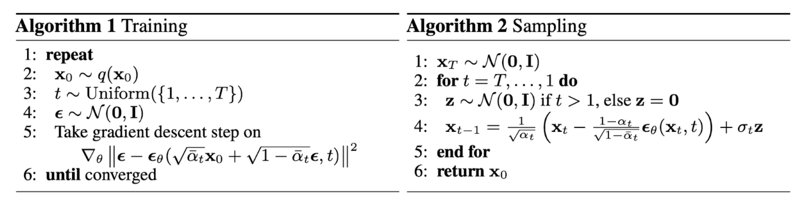

Latent Diffusion Models (LDM) 的核心思想是将扩散过程从高维像素空间转移到低维的潜空间（Latent Space），从而在保持生成质量的同时大幅降低计算成本。

<!--more-->

论文：https://arxiv.org/abs/2112.10752
代码仓库：https://github.com/CompVis/latent-diffusion

# 论文整理

Latent Diffusion Model pipeline:

**研究背景**：传统的扩散模型直接在**像素空间 (Pixel Space)** 中运行。由于高分辨率图像数据量巨大，训练和推理这些模型需要耗费数千个 GPU 天，推理速度缓慢；因此如何在有限的计算资源下，保持扩散模型在高分辨率合成上的质量和灵活性，成为了亟待解决的问题。

**核心流程**：核心流程分为两个阶段：
- 第一阶段：感知压缩 (Perceptual Compression)
训练一个强大的自动编码器（Autoencoder, VQ-GAN 或 KL-reg）。该编码器将高维的像素空间（$x$）压缩到一个计算量更小、但在空间上仍等价的潜在空间（Latent Space, $z$）。通过这一步，图像中无关紧要的高频细节被去除，保留了语义关键信息。
- 第二阶段：潜在扩散 (Latent Diffusion)
在压缩后的潜在空间中训练扩散模型（UNet）。由于空间维度显著减小（例如下采样 8 倍），计算效率大幅提升。

**条件机制**：引入了基于 Cross-Attention（交叉注意力）的通用条件接口。这使得模型可以接受文本（配合 BERT/CLIP）、语义图、甚至图像作为输入，实现可控生成（Text-to-Image）。

**主要优势**：
- 极高的效率：与像素级扩散模型相比，LDM 的计算成本大幅降低。不仅训练更快，在单张消费级 GPU 上即可进行高效采样。
- 细节保留与重构：通过将感知压缩与生成过程解耦，LDM 达到了复杂度降低与细节保留之间的近乎最优平衡。
- 强大的多模态能力：通过交叉注意力机制，模型能够灵活地处理多种条件输入，成为目前文生图领域最稳健的基础架构。
- 泛化性强：不仅能做图像生成，还可扩展到图像修复（Inpainting）、超分辨率（Super-resolution）和语义合成

该工作的开源版本 **Stable Diffusion** (由 CompVis、Runway 和 Stability AI 联合发布) 彻底改变了 AIGC 社区，使高分辨率 AI 绘画大众化。

# 代码解析

1. 核心架构 (两阶段模型)
项目采用了典型的两阶段生成框架：
- 第一阶段：自动编码器 (Autoencoder)
功能：将高分辨率图像压缩为低维的潜向量（Latent Representation），并在推理时将潜向量还原为图像。
实现：位于 ldm/models/autoencoder.py。主要包含 VQModel（基于矢量量化）和 AutoencoderKL（基于 KL 散度正则化）两种变体。
- 第二阶段：潜空间扩散模型 (LDM)
功能：在第一阶段定义的潜空间中进行扩散和逆扩散过程。
实现：核心逻辑在 ldm/models/diffusion/ddpm.py 的 LatentDiffusion 类中。它继承自 DDPM，但操作对象是潜向量而非原始像素。

2. 关键模块解析
- UNet 骨干网络：
位于 ldm/modules/diffusionmodules/openaimodel.py。这是扩散模型的核心，负责预测噪声。它支持时间步嵌入（Timestep Embedding）和跨注意力机制（Cross-Attention）。
- 条件控制 (Conditioning)：
通过 SpatialTransformer 实现，位于 ldm/modules/attention.py。这使得模型可以接受文本（通过 CLIP 编码器）、语义图或图像作为引导条件。
- 采样算法：
除了标准的 DDPM 采样，还实现了更高效的 DDIM (ldm/models/diffusion/ddim.py) 和 PLMS (ldm/models/diffusion/plms.py) 采样器。

3. 项目组织结构
- configs/：存放所有模型的配置文件（YAML）。项目使用 OmegaConf 管理参数，通过修改这些文件即可改变模型结构或训练超参。
- ldm/：核心库代码。
- models/：模型定义。
- modules/：各种神经网络层（Attention, ResNet blocks, Loss functions 等）。
- data/：数据加载逻辑。
- scripts/：功能脚本。
- txt2img.py：文本生成图像。
- inpaint.py：图像修补。
- sample_diffusion.py：通用的扩散模型采样脚本。
- main.py：训练入口文件。基于 PyTorch Lightning 框架，集成了分布式训练、日志记录（WandB/TensorBoard）和模型检查点保存。

**VQModel** 类："ldm\models\autoencoder.py"